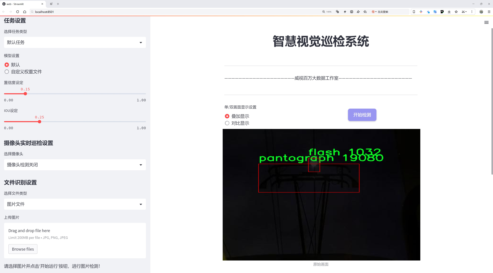

# 轨道列车触点电闪检测检测系统源码分享
 # [一条龙教学YOLOV8标注好的数据集一键训练_70+全套改进创新点发刊_Web前端展示]

### 1.研究背景与意义

项目参考[AAAI Association for the Advancement of Artificial Intelligence](https://gitee.com/qunmasj/projects)

项目来源[AACV Association for the Advancement of Computer Vision](https://github.com/qunshansj/good)

研究背景与意义

随着城市化进程的加快，轨道交通作为一种高效、环保的公共交通方式，得到了广泛应用。然而，轨道列车在运行过程中，尤其是在接触网供电系统中，常常会出现电闪现象，这不仅影响了列车的正常运行，还可能对设备造成损害，甚至引发安全事故。因此，开发一种高效、准确的电闪检测系统显得尤为重要。近年来，深度学习技术的迅猛发展为目标检测任务提供了新的解决方案，尤其是YOLO（You Only Look Once）系列模型因其高效性和实时性而备受关注。

YOLOv8作为YOLO系列的最新版本，进一步提升了目标检测的精度和速度，适用于各种复杂场景的实时检测任务。通过对YOLOv8的改进，结合轨道列车触点电闪的特定需求，可以构建一个专门针对电闪现象的检测系统。该系统不仅能够实时监测电闪事件，还能通过对触点的监测，分析其与电闪之间的关系，为后续的维护和管理提供数据支持。

在本研究中，我们将利用一个包含7846张图像的数据集，该数据集分为两个类别：电闪（flash）和受电弓（pantograph）。这些图像数据的多样性和丰富性为模型的训练提供了良好的基础，使得模型能够在不同的环境和条件下进行有效的学习。通过对这两个类别的深入分析，我们可以更好地理解电闪现象的发生机制及其与轨道列车运行的关系。

本研究的意义不仅在于提升电闪检测的准确性和实时性，更在于为轨道交通的安全运营提供技术保障。通过对电闪现象的及时检测与预警，可以有效减少因电闪引发的设备故障和安全事故，降低维护成本，提高轨道交通的运营效率。此外，该系统的成功应用还可以为其他领域的目标检测提供借鉴，推动相关技术的发展。

综上所述，基于改进YOLOv8的轨道列车触点电闪检测系统的研究，不仅具有重要的理论价值，也具备广泛的实际应用前景。通过深入探讨电闪现象的检测技术，我们希望能够为轨道交通的安全运营提供切实可行的解决方案，为城市公共交通的可持续发展贡献力量。

### 2.图片演示




##### 注意：由于此博客编辑较早，上面“2.图片演示”和“3.视频演示”展示的系统图片或者视频可能为老版本，新版本在老版本的基础上升级如下：（实际效果以升级的新版本为准）

  （1）适配了YOLOV8的“目标检测”模型和“实例分割”模型，通过加载相应的权重（.pt）文件即可自适应加载模型。

  （2）支持“图片识别”、“视频识别”、“摄像头实时识别”三种识别模式。

  （3）支持“图片识别”、“视频识别”、“摄像头实时识别”三种识别结果保存导出，解决手动导出（容易卡顿出现爆内存）存在的问题，识别完自动保存结果并导出到tempDir中。

  （4）支持Web前端系统中的标题、背景图等自定义修改，后面提供修改教程。

  另外本项目提供训练的数据集和训练教程,暂不提供权重文件（best.pt）,需要您按照教程进行训练后实现图片演示和Web前端界面演示的效果。

### 3.视频演示

[3.1 视频演示](https://www.bilibili.com/video/BV1rAHxepEdS/?vd_source=ff015de2d29cbe2a9cdbfa7064407a08)

### 4.数据集信息展示

##### 4.1 本项目数据集详细数据（类别数＆类别名）

nc: 2
names: ['flash', 'pantograph']


##### 4.2 本项目数据集信息介绍

数据集信息展示

在现代轨道交通系统中，电闪现象的检测与监测至关重要，尤其是在列车运行过程中，触点电闪可能导致设备故障或安全隐患。因此，为了提升YOLOv8模型在轨道列车触点电闪检测方面的性能，我们构建了一个专门的数据集，命名为“train”。该数据集旨在为模型提供丰富的训练样本，以便其能够准确识别和分类不同类型的电闪现象。

“train”数据集包含两个主要类别，分别是“flash”和“pantograph”。其中，“flash”类别代表了在列车运行过程中出现的电闪现象，这种现象通常伴随着强烈的光亮和瞬时的电弧，可能会对列车的正常运行造成影响。而“pantograph”类别则指的是列车上方的受电弓部件，这一部件负责与电线接触以获取电力。通过对这两个类别的有效识别，模型不仅能够及时发现潜在的电闪风险，还能对受电弓的状态进行监测，从而提高列车运行的安全性和可靠性。

数据集的构建过程涉及多种数据采集技术，包括高分辨率摄像头的使用，以确保在不同光照和天气条件下都能捕捉到清晰的图像。此外，为了增强数据集的多样性，我们还进行了数据增强处理，如旋转、缩放和亮度调整等，这些技术能够有效提升模型的泛化能力，使其在实际应用中表现更加出色。

在数据标注方面，我们采用了精细化的标注策略，确保每一张图像中的电闪和受电弓都被准确标记。这一过程不仅提高了数据集的质量，也为后续的模型训练奠定了坚实的基础。通过高质量的标注，YOLOv8模型能够在训练过程中学习到更加细致的特征，从而在实际检测中实现更高的准确率。

数据集“train”的规模也经过精心设计，以满足深度学习模型对数据量的需求。我们确保数据集中包含足够多的样本，以便模型能够在不同场景下进行有效的学习。通过多样化的样本，模型能够适应各种可能的电闪和受电弓的表现形式，从而在真实环境中更好地执行检测任务。

综上所述，数据集“train”不仅为YOLOv8模型的训练提供了必要的基础数据，还通过精细的标注和多样化的样本设计，确保了模型在轨道列车触点电闪检测中的有效性和可靠性。随着该数据集的应用，我们期待能够显著提升列车运行的安全监测能力，为轨道交通的智能化发展贡献一份力量。


### 5.全套项目环境部署视频教程（零基础手把手教学）

[5.1 环境部署教程链接（零基础手把手教学）](https://www.ixigua.com/7404473917358506534?logTag=c807d0cbc21c0ef59de5)


[5.2 安装Python虚拟环境创建和依赖库安装视频教程链接（零基础手把手教学）](https://www.ixigua.com/7404474678003106304?logTag=1f1041108cd1f708b01a)

### 6.手把手YOLOV8训练视频教程（零基础小白有手就能学会）

[6.1 环境部署教程链接（零基础手把手教学）](https://www.ixigua.com/7404477157818401292?logTag=d31a2dfd1983c9668658)

### 7.70+种全套YOLOV8创新点代码加载调参视频教程（一键加载写好的改进模型的配置文件）

[7.1 环境部署教程链接（零基础手把手教学）](https://www.ixigua.com/7404478314661806627?logTag=29066f8288e3f4eea3a4)

### 8.70+种全套YOLOV8创新点原理讲解（非科班也可以轻松写刊发刊，V10版本正在科研待更新）

由于篇幅限制，每个创新点的具体原理讲解就不一一展开，具体见下列网址中的创新点对应子项目的技术原理博客网址【Blog】：


[8.1 70+种全套YOLOV8创新点原理讲解链接](https://gitee.com/qunmasj/good)

### 9.系统功能展示（检测对象为举例，实际内容以本项目数据集为准）

图9.1.系统支持检测结果表格显示

  图9.2.系统支持置信度和IOU阈值手动调节

  图9.3.系统支持自定义加载权重文件best.pt(需要你通过步骤5中训练获得)

  图9.4.系统支持摄像头实时识别

  图9.5.系统支持图片识别

  图9.6.系统支持视频识别

  图9.7.系统支持识别结果文件自动保存

  图9.8.系统支持Excel导出检测结果数据


### 10.原始YOLOV8算法原理

原始YOLOv8算法原理

YOLOv8（You Only Look Once version 8）作为YOLO系列的最新成员，代表了目标检测领域的一次重要技术进步。它不仅继承了前几代YOLO模型的优点，还在多个方面进行了创新和改进，特别是在检测精度和速度上。YOLOv8的设计理念是通过一种高效的端到端的检测框架，实时处理图像并进行目标识别，广泛应用于各类计算机视觉任务中。

YOLOv8的网络结构主要由四个模块组成：输入端、主干网络、Neck端和输出端。输入端负责对输入图像进行预处理，包括Mosaic数据增强、自适应图片缩放和灰度填充等。这些预处理步骤旨在提高模型的鲁棒性，使其能够更好地适应不同的图像质量和环境条件。主干网络则通过卷积、池化等操作提取图像特征，采用了CSP（跨阶段局部网络）和SPPF（Spatial Pyramid Pooling Fast）等结构，以实现更高效的特征提取。

在Neck端，YOLOv8采用了PAN（Path Aggregation Network）结构，通过上采样和下采样的方式对不同尺度的特征图进行融合。这种特征融合方法使得模型能够更好地捕捉到目标的多尺度信息，从而提高检测精度。Neck端的设计是YOLOv8的一大亮点，它通过有效的特征传递机制，确保了从主干网络提取的特征能够在输出端得到充分利用。

输出端则采用了decoupled head结构，实现了分类和回归过程的解耦。这一设计的核心在于通过Task-Aligned Assigner方法对分类分数和回归分数进行加权，从而更精确地匹配正样本。损失计算方面，YOLOv8使用了BCE（Binary Cross-Entropy）损失函数来计算分类损失，同时采用DFL（Distribution Focal Loss）和CIoU（Complete Intersection over Union）损失函数来计算回归损失。这些损失函数的选择旨在提高模型的训练效率和最终的检测精度。

YOLOv8的一个显著特点是其采用了anchor-free的检测方法。这一方法相较于传统的anchor-based检测方法，具有更高的检测精度和速度，尤其在复杂的背景下，能够更有效地定位目标。然而，在某些特定场景下，如复杂水面环境中，小目标漂浮物的检测仍然面临挑战。YOLOv8在这些情况下可能会出现定位误差和对目标感知能力不足的问题。

为了应对这些挑战，YOLOv8的改进版本——YOLOv8-WSSOD算法应运而生。该算法通过引入BiFormer双层路由注意力机制构建C2fBF模块，旨在减轻主干网络下采样过程中的噪声影响，并保留特征提取过程中更细粒度的上下文信息。此外，为了提升网络对小目标的感知能力，YOLOv8-WSSOD在网络中添加了一个更小的检测头，并在Neck端引入GSConv和Slim-neck技术，以保持精度的同时降低计算量。最后，YOLOv8-WSSOD使用MPDIoU损失函数替换CIoU损失函数，以提高模型的泛化能力和精准度。

总的来说，YOLOv8的设计与实现体现了目标检测领域对高效性和准确性的追求。其创新的网络结构和损失函数设计，使得YOLOv8在处理复杂场景时表现出色。尽管在某些特定环境下仍存在一定的局限性，但通过不断的改进和优化，YOLOv8及其衍生版本有望在未来的目标检测任务中发挥更大的作用。随着YOLOv8的推广和应用，其在自动驾驶、安防监控、智能制造等领域的潜力将进一步得到释放，为计算机视觉技术的发展注入新的活力。


### 11.项目核心源码讲解（再也不用担心看不懂代码逻辑）

#### 11.1 ultralytics\engine\model.py

以下是经过简化和注释的核心代码，保留了YOLO模型的基本功能和结构。

```python
# Ultralytics YOLO 🚀, AGPL-3.0 license

import inspect
import sys
from pathlib import Path
from typing import Union
from ultralytics.nn import nn  # 导入PyTorch的nn模块

class Model(nn.Module):
    """
    YOLO模型的基础类，统一所有模型的API。

    参数:
        model (str, Path): 要加载或创建的模型文件路径。
        task (Any, optional): YOLO模型的任务类型。默认为None。

    属性:
        predictor (Any): 预测器对象。
        model (Any): 模型对象。
        task (str): 模型任务类型。
        ckpt (Any): 从*.pt文件加载的检查点对象。
        cfg (str): 从*.yaml文件加载的模型配置。
    """

    def __init__(self, model: Union[str, Path] = "yolov8n.pt", task=None) -> None:
        """
        初始化YOLO模型。

        参数:
            model (Union[str, Path], optional): 要加载或创建的模型路径或名称。默认为'yolov8n.pt'。
            task (Any, optional): YOLO模型的任务类型。默认为None。
        """
        super().__init__()
        self.model = None  # 模型对象
        self.task = task  # 任务类型
        self.model_name = str(model).strip()  # 去除空格的模型名称

        # 检查模型文件并加载
        model = self._check_and_load_model(model)

    def _check_and_load_model(self, model: str):
        """检查并加载模型文件，返回模型路径。"""
        # 检查模型文件后缀并加载模型
        if Path(model).suffix in (".yaml", ".yml"):
            self._new(model)
        else:
            self._load(model)
        return model

    def _new(self, cfg: str):
        """初始化新模型并推断任务类型。"""
        # 从配置文件加载模型
        self.cfg = cfg
        self.model = self._smart_load("model")(cfg)  # 构建模型

    def _load(self, weights: str):
        """加载现有模型的权重。"""
        self.model = self._smart_load("load_weights")(weights)  # 加载权重

    def predict(self, source=None, **kwargs):
        """
        使用YOLO模型进行预测。

        参数:
            source (str | int | PIL | np.ndarray): 进行预测的图像源。
            **kwargs : 传递给预测器的其他关键字参数。

        返回:
            (List[ultralytics.engine.results.Results]): 预测结果。
        """
        if source is None:
            source = "default_source"  # 默认源
        # 进行预测
        return self.model.predict(source, **kwargs)

    def _smart_load(self, key):
        """加载模型、训练器、验证器或预测器。"""
        # 根据任务类型返回相应的类
        try:
            return self.task_map[self.task][key]
        except Exception as e:
            raise NotImplementedError(f"模型不支持此任务类型: {self.task}") from e

    @property
    def task_map(self):
        """任务映射，返回模型、训练器、验证器和预测器类的映射。"""
        raise NotImplementedError("请提供模型的任务映射！")
```

### 代码说明：
1. **类定义**：`Model`类继承自`nn.Module`，是YOLO模型的基础类。
2. **初始化方法**：`__init__`方法接收模型路径和任务类型，初始化模型。
3. **模型加载**：`_check_and_load_model`方法检查模型文件类型并调用相应的加载方法。
4. **新模型初始化**：`_new`方法从配置文件创建新模型。
5. **加载现有模型**：`_load`方法加载已有模型的权重。
6. **预测方法**：`predict`方法使用模型进行预测，接受图像源和其他参数。
7. **智能加载**：`_smart_load`方法根据任务类型加载相应的类。
8. **任务映射**：`task_map`属性用于映射不同任务到相应的模型、训练器等。

以上代码是YOLO模型的核心部分，提供了模型的初始化、加载和预测功能。

这个文件是Ultralytics YOLO模型的核心实现部分，主要定义了一个名为`Model`的类，该类用于统一所有YOLO模型的API。这个类包含了模型的初始化、加载、预测、训练等功能，能够处理不同类型的YOLO模型任务。

在类的构造函数`__init__`中，用户可以指定模型的路径和任务类型。如果模型来自Ultralytics HUB，系统会自动处理相关的会话；如果是Triton Server模型，则直接设置模型。接着，系统会根据模型文件的后缀名判断是加载已有模型还是创建新模型。

`Model`类的核心方法包括：
- `__call__`：使得模型对象可以像函数一样被调用，实际上是调用`predict`方法进行预测。
- `_new`和`_load`：分别用于初始化新模型和加载已有模型的权重。
- `predict`：执行模型的预测功能，支持多种输入源，如文件路径、视频流等。
- `train`：用于训练模型，支持从配置文件中读取训练参数。
- `val`：对模型进行验证，评估其在给定数据集上的表现。
- `export`：将模型导出为其他格式，以便于在不同平台上使用。

此外，类中还定义了一些辅助方法，例如`_check_is_pytorch_model`用于检查模型是否为PyTorch格式，`reset_weights`用于重置模型的权重，`fuse`用于融合模型的卷积层和批归一化层以加速推理。

类中还包含了一些属性，如`names`、`device`和`transforms`，分别用于获取模型的类别名称、设备信息和变换操作。

最后，类提供了回调机制，允许用户在特定事件发生时执行自定义函数，这为模型的训练和预测过程提供了灵活性。

总体来说，这个文件实现了YOLO模型的主要功能，提供了丰富的接口以支持模型的加载、训练、预测和导出，适用于各种计算机视觉任务。

#### 11.2 ultralytics\utils\benchmarks.py

以下是经过简化和注释的核心代码部分，主要包含了 `benchmark` 函数和 `ProfileModels` 类。注释详细解释了每个部分的功能和作用。

```python
import glob
import time
from pathlib import Path
import numpy as np
import torch.cuda
from ultralytics import YOLO
from ultralytics.utils import LOGGER, select_device

def benchmark(
    model=WEIGHTS_DIR / "yolov8n.pt", data=None, imgsz=160, half=False, int8=False, device="cpu", verbose=False
):
    """
    基准测试 YOLO 模型在不同格式下的速度和准确性。

    参数:
        model (str | Path): 模型文件或目录的路径，默认为 yolov8n.pt。
        data (str, optional): 用于评估的数据集，默认为 None。
        imgsz (int, optional): 基准测试的图像大小，默认为 160。
        half (bool, optional): 是否使用半精度模型，默认为 False。
        int8 (bool, optional): 是否使用 int8 精度模型，默认为 False。
        device (str, optional): 运行基准测试的设备，默认为 'cpu'。
        verbose (bool | float, optional): 如果为 True 或浮点数，则在给定指标下断言基准测试通过，默认为 False。

    返回:
        df (pandas.DataFrame): 包含每种格式的基准测试结果的 DataFrame，包括文件大小、指标和推理时间。
    """
    import pandas as pd

    # 设置 pandas 显示选项
    pd.options.display.max_columns = 10
    pd.options.display.width = 120
    device = select_device(device, verbose=False)  # 选择设备
    if isinstance(model, (str, Path)):
        model = YOLO(model)  # 加载 YOLO 模型

    results = []  # 存储结果
    start_time = time.time()  # 记录开始时间

    # 遍历导出格式
    for i, (name, format, suffix, cpu, gpu) in export_formats().iterrows():
        emoji, filename = "❌", None  # 默认导出状态
        try:
            # 检查设备支持情况
            if "cpu" in device.type:
                assert cpu, "inference not supported on CPU"
            if "cuda" in device.type:
                assert gpu, "inference not supported on GPU"

            # 导出模型
            if format == "-":
                filename = model.ckpt_path or model.cfg  # PyTorch 格式
                exported_model = model
            else:
                filename = model.export(imgsz=imgsz, format=format, half=half, int8=int8, device=device, verbose=False)
                exported_model = YOLO(filename, task=model.task)  # 加载导出的模型
                assert suffix in str(filename), "export failed"
            emoji = "✅"  # 导出成功

            # 进行推理
            exported_model.predict(ASSETS / "bus.jpg", imgsz=imgsz, device=device, half=half)

            # 验证模型
            data = data or TASK2DATA[model.task]  # 获取数据集
            key = TASK2METRIC[model.task]  # 获取指标
            results = exported_model.val(
                data=data, batch=1, imgsz=imgsz, plots=False, device=device, half=half, int8=int8, verbose=False
            )
            metric, speed = results.results_dict[key], results.speed["inference"]
            results.append([name, "✅", round(file_size(filename), 1), round(metric, 4), round(speed, 2)])
        except Exception as e:
            LOGGER.warning(f"ERROR ❌️ Benchmark failure for {name}: {e}")
            results.append([name, emoji, round(file_size(filename), 1), None, None])  # 记录失败情况

    # 打印结果
    df = pd.DataFrame(results, columns=["Format", "Status❔", "Size (MB)", key, "Inference time (ms/im)"])
    LOGGER.info(f"Benchmarks complete: {df}\n")
    return df

class ProfileModels:
    """
    ProfileModels 类用于对不同模型进行性能分析。

    属性:
        paths (list): 要分析的模型路径列表。
        num_timed_runs (int): 分析的计时运行次数，默认为 100。
        num_warmup_runs (int): 分析前的热身运行次数，默认为 10。
        min_time (float): 分析的最小时间（秒），默认为 60。
        imgsz (int): 分析中使用的图像大小，默认为 640。

    方法:
        profile(): 分析模型并打印结果。
    """

    def __init__(self, paths: list, num_timed_runs=100, num_warmup_runs=10, min_time=60, imgsz=640):
        self.paths = paths  # 模型路径
        self.num_timed_runs = num_timed_runs  # 计时运行次数
        self.num_warmup_runs = num_warmup_runs  # 热身运行次数
        self.min_time = min_time  # 最小分析时间
        self.imgsz = imgsz  # 图像大小
        self.device = torch.device(0 if torch.cuda.is_available() else "cpu")  # 选择设备

    def profile(self):
        """记录模型的基准测试结果并返回结果。"""
        files = self.get_files()  # 获取模型文件

        if not files:
            print("未找到匹配的模型文件。")
            return

        table_rows = []  # 存储表格行
        for file in files:
            model = YOLO(str(file))  # 加载模型
            model_info = model.info()  # 获取模型信息
            t_onnx = self.profile_onnx_model(str(file))  # 分析 ONNX 模型
            table_rows.append(self.generate_table_row(file.stem, t_onnx, model_info))  # 生成表格行

        self.print_table(table_rows)  # 打印表格

    def get_files(self):
        """返回用户提供的所有相关模型文件的路径列表。"""
        files = []
        for path in self.paths:
            path = Path(path)
            if path.is_dir():
                files.extend(glob.glob(str(path / "*.pt")) + glob.glob(str(path / "*.onnx")))  # 获取目录下的模型文件
            elif path.suffix in {".pt", ".onnx"}:
                files.append(str(path))  # 添加单个文件
        return [Path(file) for file in sorted(files)]  # 返回文件路径列表

    def profile_onnx_model(self, onnx_file: str):
        """分析 ONNX 模型并返回运行时间的均值和标准差。"""
        import onnxruntime as ort
        sess = ort.InferenceSession(onnx_file)  # 创建 ONNX 会话
        input_data = np.random.rand(1, 3, self.imgsz, self.imgsz).astype(np.float32)  # 生成随机输入数据

        # 进行多次推理以获取运行时间
        run_times = []
        for _ in range(self.num_timed_runs):
            start_time = time.time()
            sess.run(None, {sess.get_inputs()[0].name: input_data})  # 执行推理
            run_times.append((time.time() - start_time) * 1000)  # 记录推理时间（毫秒）

        return np.mean(run_times), np.std(run_times)  # 返回均值和标准差

    def print_table(self, table_rows):
        """格式化并打印模型性能比较表。"""
        header = "| Model | Speed (ms) |"
        separator = "|-------|------------|"
        print(header)
        print(separator)
        for row in table_rows:
            print(row)  # 打印每一行
```

### 代码说明：
1. **benchmark 函数**：该函数用于对 YOLO 模型进行基准测试，评估其在不同格式下的速度和准确性。它接受多个参数，包括模型路径、数据集、图像大小等，并返回一个包含测试结果的 DataFrame。

2. **ProfileModels 类**：该类用于分析不同模型的性能，支持 ONNX 和 TensorRT 格式。它可以获取模型文件，执行基准测试，并打印结果。

3. **get_files 方法**：用于获取指定路径下的模型文件，支持目录和单个文件。

4. **profile_onnx_model 方法**：对 ONNX 模型进行性能分析，返回运行时间的均值和标准差。

5. **print_table 方法**：格式化并打印模型性能比较表，便于查看不同模型的性能指标。

这个程序文件 `ultralytics/utils/benchmarks.py` 主要用于对 YOLO 模型进行基准测试，以评估其在不同格式下的速度和准确性。文件中包含了两个主要的类和多个函数，具体功能如下：

首先，文件的开头部分包含了模块的使用说明，包括如何导入和使用 `ProfileModels` 和 `benchmark` 函数。用户可以通过提供模型的路径和图像大小来进行基准测试，并且支持多种模型格式的导出，如 PyTorch、ONNX、TensorRT 等。

`benchmark` 函数是该文件的核心功能之一。它接受多个参数，包括模型路径、数据集、图像大小、是否使用半精度或整型精度、设备类型（CPU 或 GPU）以及是否显示详细信息。该函数的主要流程是加载模型，然后针对不同的导出格式进行模型的导出和推理测试。它会记录每种格式的文件大小、性能指标（如 mAP 和推理时间），并将结果存储在一个 pandas DataFrame 中，最后返回这个 DataFrame。

在 `benchmark` 函数中，使用了 `export_formats` 函数来获取支持的导出格式，并依次进行模型的导出和推理。对于每种格式，函数会进行错误处理，确保在不支持的情况下给出相应的警告。最终，基准测试的结果会被记录到日志文件中，并且如果启用了详细模式，还会进行指标的验证。

另一个重要的类是 `ProfileModels`，它用于对不同模型进行性能分析。该类可以接受多个模型路径，并对其进行基准测试，包括模型的速度和浮点运算次数（FLOPs）。在初始化时，用户可以设置一些参数，如定时运行的次数、预热运行的次数、最小运行时间和图像大小等。`profile` 方法会获取模型文件，进行 ONNX 和 TensorRT 的性能分析，并生成相应的结果表格。

在 `ProfileModels` 类中，`get_files` 方法用于获取指定路径下的模型文件，`get_onnx_model_info` 方法用于提取 ONNX 模型的信息，`profile_tensorrt_model` 和 `profile_onnx_model` 方法则分别用于对 TensorRT 和 ONNX 模型进行性能基准测试。这些方法通过多次运行模型并记录运行时间，计算出平均时间和标准差，以评估模型的性能。

最后，文件中还包含了一些辅助函数，如 `iterative_sigma_clipping` 用于处理运行时间数据的异常值，`generate_table_row` 和 `generate_results_dict` 用于生成格式化的结果输出。这些功能共同构成了一个完整的基准测试框架，帮助用户评估和比较不同 YOLO 模型在各种环境下的性能表现。

#### 11.3 ui.py

```python
import sys
import subprocess

def run_script(script_path):
    """
    使用当前 Python 环境运行指定的脚本。

    Args:
        script_path (str): 要运行的脚本路径

    Returns:
        None
    """
    # 获取当前 Python 解释器的路径
    python_path = sys.executable

    # 构建运行命令
    command = f'"{python_path}" -m streamlit run "{script_path}"'

    # 执行命令
    result = subprocess.run(command, shell=True)
    if result.returncode != 0:
        print("脚本运行出错。")


# 实例化并运行应用
if __name__ == "__main__":
    # 指定您的脚本路径
    script_path = "web.py"  # 这里直接指定脚本路径

    # 运行脚本
    run_script(script_path)
```

### 代码核心部分及详细注释

1. **导入必要的模块**：
   - `sys`: 用于访问与 Python 解释器相关的变量和函数。
   - `subprocess`: 用于创建新进程、连接到它们的输入/输出/错误管道，并获得返回码。

2. **定义 `run_script` 函数**：
   - 该函数接受一个参数 `script_path`，表示要运行的 Python 脚本的路径。
   - 函数内部首先获取当前 Python 解释器的路径，以便在正确的环境中运行脚本。

3. **构建运行命令**：
   - 使用格式化字符串构建命令，命令的格式为：`"{python_path}" -m streamlit run "{script_path}"`。
   - 这里使用 `-m streamlit run` 是为了通过 Streamlit 运行指定的脚本。

4. **执行命令**：
   - 使用 `subprocess.run` 方法执行构建的命令。
   - `shell=True` 参数允许在 shell 中执行命令。
   - 检查返回码，如果不为 0，表示脚本运行出错，打印错误信息。

5. **主程序入口**：
   - 使用 `if __name__ == "__main__":` 确保该代码块仅在脚本作为主程序运行时执行。
   - 指定要运行的脚本路径为 `web.py`。
   - 调用 `run_script` 函数来执行指定的脚本。

这个程序文件名为 `ui.py`，其主要功能是通过当前的 Python 环境来运行一个指定的脚本，具体是使用 Streamlit 框架来启动一个 Web 应用。

程序首先导入了必要的模块，包括 `sys`、`os` 和 `subprocess`，其中 `sys` 用于访问与 Python 解释器相关的变量和函数，`os` 用于与操作系统交互，而 `subprocess` 则用于执行外部命令。

接下来，程序定义了一个名为 `run_script` 的函数，该函数接受一个参数 `script_path`，表示要运行的脚本的路径。在函数内部，首先获取当前 Python 解释器的路径，这样可以确保在正确的环境中运行脚本。然后，构建一个命令字符串，该命令使用 Streamlit 的 `run` 功能来执行指定的脚本。命令的格式为 `"{python_path}" -m streamlit run "{script_path}"`，其中 `python_path` 是当前 Python 解释器的路径，`script_path` 是要运行的脚本路径。

接着，使用 `subprocess.run` 方法来执行构建好的命令。如果命令执行的返回码不为 0，表示脚本运行过程中出现了错误，此时程序会打印出“脚本运行出错。”的提示信息。

在文件的最后部分，程序通过 `if __name__ == "__main__":` 语句来判断当前模块是否是主程序。如果是，则指定要运行的脚本路径为 `web.py`，并调用 `run_script` 函数来执行这个脚本。

整体来看，这个程序的作用是简化在命令行中启动 Streamlit 应用的过程，使得用户可以通过运行 `ui.py` 来启动 `web.py` 脚本。

#### 11.4 model.py

以下是经过简化和详细注释的核心代码部分：

```python
# -*- coding: utf-8 -*-
import cv2  # 导入OpenCV库，用于处理图像和视频
import torch  # 导入PyTorch库，用于深度学习
from ultralytics import YOLO  # 从ultralytics库中导入YOLO类，用于加载YOLO模型
from ultralytics.utils.torch_utils import select_device  # 导入设备选择工具

# 根据是否有可用的GPU选择设备
device = "cuda:0" if torch.cuda.is_available() else "cpu"

# 初始化参数
ini_params = {
    'device': device,  # 设备类型
    'conf': 0.25,  # 物体置信度阈值
    'iou': 0.5,  # IOU阈值，用于非极大值抑制
    'classes': None,  # 类别过滤器
    'verbose': False  # 是否详细输出
}

class Web_Detector:  # 定义Web_Detector类
    def __init__(self, params=None):  # 构造函数
        self.model = None  # 初始化模型为None
        self.params = params if params else ini_params  # 使用提供的参数或默认参数

    def load_model(self, model_path):  # 加载模型的方法
        self.device = select_device(self.params['device'])  # 选择设备
        task = 'segment' if os.path.basename(model_path)[:3] == 'seg' else 'detect'  # 根据模型类型选择任务
        self.model = YOLO(model_path, task=task)  # 加载YOLO模型

        # 预热模型
        self.model(torch.zeros(1, 3, 640, 640).to(self.device).type_as(next(self.model.model.parameters())))

    def predict(self, img):  # 预测方法
        results = self.model(img, **ini_params)  # 使用模型进行预测
        return results  # 返回预测结果

    def postprocess(self, pred):  # 后处理方法
        results = []  # 初始化结果列表

        for res in pred[0].boxes:  # 遍历预测结果中的每个边界框
            for box in res:
                class_id = int(box.cls.cpu())  # 获取类别ID
                bbox = box.xyxy.cpu().squeeze().tolist()  # 获取边界框坐标
                bbox = [int(coord) for coord in bbox]  # 转换为整数

                result = {
                    "class_name": self.model.names[class_id],  # 类别名称
                    "bbox": bbox,  # 边界框
                    "score": box.conf.cpu().squeeze().item(),  # 置信度
                    "class_id": class_id  # 类别ID
                }
                results.append(result)  # 将结果添加到列表

        return results  # 返回处理后的结果列表
```

### 代码说明：
1. **设备选择**：根据是否有可用的GPU选择设备（`cuda:0`或`cpu`）。
2. **初始化参数**：设置模型的基本参数，包括置信度阈值和IOU阈值。
3. **Web_Detector类**：这是一个检测器类，负责加载模型、进行预测和后处理。
   - `__init__`：构造函数，初始化模型和参数。
   - `load_model`：加载YOLO模型并进行预热。
   - `predict`：使用加载的模型对输入图像进行预测。
   - `postprocess`：处理预测结果，提取类别名称、边界框和置信度等信息，并返回结果列表。

这个程序文件 `model.py` 主要实现了一个基于YOLO模型的目标检测器，使用了OpenCV和PyTorch等库。首先，程序导入了必要的库，包括OpenCV用于图像处理，PyTorch用于深度学习，QtFusion库中的Detector和HeatmapGenerator类，以及ultralytics库中的YOLO类和select_device函数。

接下来，程序根据是否有可用的CUDA设备来选择计算设备，如果有则使用GPU（"cuda:0"），否则使用CPU。然后定义了一些初始化参数，包括物体置信度阈值、IOU阈值和类别过滤器等。

`count_classes` 函数用于统计检测结果中每个类别的数量。它接收检测信息和类别名称列表作为参数，创建一个字典来存储每个类别的计数，遍历检测信息并更新计数，最后返回一个按类别名称顺序排列的计数列表。

`Web_Detector` 类继承自 `Detector` 类，构造函数中初始化了一些属性，包括模型、图像和类别名称。`load_model` 方法用于加载YOLO模型，首先选择计算设备，然后根据模型路径判断任务类型（检测或分割），接着加载模型并将类别名称转换为中文。为了提高模型的推理速度，调用了一个预热步骤。

`preprocess` 方法用于图像的预处理，简单地保存原始图像并返回。`predict` 方法则执行模型的预测，返回预测结果。`postprocess` 方法对预测结果进行后处理，提取每个检测框的信息，包括类别名称、边界框坐标、置信度和类别ID，并将这些信息存储在结果列表中返回。

最后，`set_param` 方法用于更新检测器的参数，可以根据需要调整模型的配置。整体来看，这个程序文件提供了一个完整的目标检测框架，能够加载模型、处理图像、进行预测并返回结果。

#### 11.5 train.py

以下是经过简化和注释的核心代码部分：

```python
import os
import torch
import yaml
from ultralytics import YOLO  # 导入YOLO模型库
from QtFusion.path import abs_path  # 导入路径处理函数

# 设置设备为GPU（如果可用），否则使用CPU
device = "0" if torch.cuda.is_available() else "cpu"

if __name__ == '__main__':  # 确保该模块被直接运行时才执行以下代码
    # 定义工作进程数和批次大小
    workers = 1
    batch = 2

    # 定义数据集名称
    data_name = "data"
    # 获取数据集yaml文件的绝对路径
    data_path = abs_path(f'datasets/{data_name}/{data_name}.yaml', path_type='current')
    unix_style_path = data_path.replace(os.sep, '/')  # 转换为Unix风格路径

    # 获取数据集目录路径
    directory_path = os.path.dirname(unix_style_path)
    
    # 读取YAML配置文件
    with open(data_path, 'r') as file:
        data = yaml.load(file, Loader=yaml.FullLoader)
    
    # 如果YAML文件中包含'path'项，则更新为当前目录路径
    if 'path' in data:
        data['path'] = directory_path
        # 将修改后的数据写回YAML文件
        with open(data_path, 'w') as file:
            yaml.safe_dump(data, file, sort_keys=False)

    # 加载YOLOv8模型配置
    model = YOLO(model='./ultralytics/cfg/models/v8/yolov8s.yaml', task='detect')
    
    # 开始训练模型
    results2 = model.train(
        data=data_path,  # 指定训练数据的配置文件路径
        device=device,  # 使用指定的设备进行训练
        workers=workers,  # 使用的工作进程数
        imgsz=640,  # 输入图像的大小
        epochs=100,  # 训练的轮数
        batch=batch,  # 每个批次的大小
        name='train_v8_' + data_name  # 训练任务的名称
    )
```

### 代码注释说明：
1. **导入必要的库**：引入了处理文件、模型和路径的库。
2. **设备选择**：根据是否有可用的GPU选择计算设备。
3. **数据集路径处理**：通过`abs_path`函数获取数据集的绝对路径，并转换为Unix风格路径。
4. **读取和修改YAML文件**：读取数据集的配置文件，更新其中的路径信息，并将修改后的内容写回文件。
5. **模型加载**：加载YOLOv8模型的配置文件，准备进行目标检测任务。
6. **模型训练**：调用`train`方法开始训练，传入必要的参数，如数据路径、设备、工作进程数、图像大小、训练轮数和批次大小。

该程序文件 `train.py` 是一个用于训练 YOLOv8 模型的脚本。首先，程序导入了必要的库，包括 `os`、`torch`、`yaml` 和 `ultralytics` 中的 YOLO 模型。它还通过 `QtFusion.path` 导入了一个用于获取绝对路径的函数。接着，程序判断当前是否可以使用 GPU，如果可以，则将设备设置为 "0"（表示使用第一个 GPU），否则使用 CPU。

在 `__main__` 代码块中，程序设置了一些训练参数，包括工作进程数量 `workers` 和批次大小 `batch`。接下来，程序定义了数据集的名称 `data_name`，并构建了数据集 YAML 文件的绝对路径。这里使用了 `abs_path` 函数来获取路径，并将系统路径分隔符替换为 Unix 风格的斜杠。

程序获取了数据集目录的路径，并打开 YAML 文件以读取数据。读取后，程序检查 YAML 数据中是否包含 `path` 项，如果有，则将其修改为数据集的目录路径，并将更新后的数据写回 YAML 文件中，以确保后续训练能够正确找到数据集。

随后，程序加载了预训练的 YOLOv8 模型，指定了模型的配置文件。接着，程序调用 `model.train()` 方法开始训练模型。在训练过程中，程序指定了训练数据的配置文件路径、设备、工作进程数量、输入图像的大小（640x640）、训练的 epoch 数量（100）以及训练任务的名称（以 `train_v8_` 开头，后接数据集名称）。

总体来说，该脚本的主要功能是配置并启动 YOLOv8 模型的训练过程，确保数据集路径正确，并设置训练参数以适应特定的训练需求。

#### 11.6 ultralytics\utils\callbacks\neptune.py

以下是经过简化并添加详细中文注释的核心代码部分：

```python
# 导入必要的库
from ultralytics.utils import LOGGER, SETTINGS, TESTS_RUNNING

# 尝试导入 Neptune 库并进行初始化
try:
    assert not TESTS_RUNNING  # 确保不在测试模式下
    assert SETTINGS["neptune"] is True  # 确保启用了 Neptune 集成
    import neptune
    from neptune.types import File

    assert hasattr(neptune, "__version__")  # 确保 Neptune 库版本存在

    run = None  # 初始化 NeptuneAI 实验记录实例

except (ImportError, AssertionError):
    neptune = None  # 如果导入失败，设置 neptune 为 None


def _log_scalars(scalars, step=0):
    """将标量数据记录到 NeptuneAI 实验记录器中。"""
    if run:  # 如果 run 已初始化
        for k, v in scalars.items():  # 遍历标量字典
            run[k].append(value=v, step=step)  # 记录每个标量


def _log_images(imgs_dict, group=""):
    """将图像记录到 NeptuneAI 实验记录器中。"""
    if run:  # 如果 run 已初始化
        for k, v in imgs_dict.items():  # 遍历图像字典
            run[f"{group}/{k}"].upload(File(v))  # 上传每个图像


def on_pretrain_routine_start(trainer):
    """在训练例程开始前调用的回调函数。"""
    try:
        global run
        # 初始化 Neptune 运行
        run = neptune.init_run(project=trainer.args.project or "YOLOv8", name=trainer.args.name, tags=["YOLOv8"])
        # 记录超参数配置
        run["Configuration/Hyperparameters"] = {k: "" if v is None else v for k, v in vars(trainer.args).items()}
    except Exception as e:
        LOGGER.warning(f"WARNING ⚠️ NeptuneAI 安装但未正确初始化，未记录此运行。 {e}")


def on_train_epoch_end(trainer):
    """每个训练周期结束时调用的回调函数。"""
    # 记录训练损失和学习率
    _log_scalars(trainer.label_loss_items(trainer.tloss, prefix="train"), trainer.epoch + 1)
    _log_scalars(trainer.lr, trainer.epoch + 1)
    if trainer.epoch == 1:  # 如果是第一个周期
        # 记录训练批次图像
        _log_images({f.stem: str(f) for f in trainer.save_dir.glob("train_batch*.jpg")}, "Mosaic")


def on_train_end(trainer):
    """训练结束时调用的回调函数。"""
    if run:  # 如果 run 已初始化
        # 记录最终结果、混淆矩阵和 PR 图
        files = [
            "results.png",
            "confusion_matrix.png",
            "confusion_matrix_normalized.png",
            *(f"{x}_curve.png" for x in ("F1", "PR", "P", "R")),
        ]
        # 过滤存在的文件
        files = [(trainer.save_dir / f) for f in files if (trainer.save_dir / f).exists()]
        for f in files:
            _log_plot(title=f.stem, plot_path=f)  # 记录每个图表
        # 记录最终模型
        run[f"weights/{trainer.args.name or trainer.args.task}/{trainer.best.name}"].upload(File(str(trainer.best)))


# 定义回调函数集合
callbacks = (
    {
        "on_pretrain_routine_start": on_pretrain_routine_start,
        "on_train_epoch_end": on_train_epoch_end,
        "on_fit_epoch_end": on_fit_epoch_end,
        "on_val_end": on_val_end,
        "on_train_end": on_train_end,
    }
    if neptune  # 如果 Neptune 已初始化
    else {}
)
```

### 代码说明：
1. **导入部分**：导入了必要的库，并尝试初始化 Neptune 实验记录器。
2. **日志记录函数**：
   - `_log_scalars`：用于记录标量数据（如损失和学习率）。
   - `_log_images`：用于记录图像数据（如训练批次图像）。
3. **回调函数**：
   - `on_pretrain_routine_start`：在训练开始前初始化 Neptune 记录器并记录超参数。
   - `on_train_epoch_end`：在每个训练周期结束时记录损失和学习率，并在第一个周期记录训练图像。
   - `on_train_end`：在训练结束时记录最终结果和模型权重。
4. **回调集合**：根据 Neptune 是否初始化，定义相应的回调函数集合。

这个程序文件是用于集成NeptuneAI的回调函数，主要用于在训练YOLO模型时记录实验数据和结果。首先，文件通过导入相关模块和库，确保在NeptuneAI的环境中运行，并检查Neptune是否已正确安装和初始化。如果没有安装或初始化不正确，程序将不会记录任何数据。

文件中定义了一些私有函数，例如`_log_scalars`、`_log_images`和`_log_plot`，这些函数分别用于记录标量数据、图像和绘图。`_log_scalars`函数将标量数据（如损失值和学习率）记录到Neptune中，`_log_images`函数用于上传训练过程中生成的图像，而`_log_plot`函数则用于上传绘图结果。

接下来，文件定义了一些回调函数，这些函数在训练过程中的特定时刻被调用。例如，`on_pretrain_routine_start`函数在训练开始前被调用，用于初始化Neptune的运行实例并记录超参数配置。`on_train_epoch_end`函数在每个训练周期结束时被调用，记录训练损失和学习率，并在第一轮结束时上传训练图像。`on_fit_epoch_end`函数在每个训练和验证周期结束时被调用，记录模型的配置信息和性能指标。`on_val_end`函数在验证结束时被调用，上传验证集的图像。最后，`on_train_end`函数在训练结束时被调用，记录最终的结果、混淆矩阵和PR曲线，并上传最佳模型的权重。

最后，文件创建了一个回调字典`callbacks`，如果Neptune已正确初始化，则将上述回调函数添加到字典中，以便在训练过程中调用。这个文件的整体目的是通过NeptuneAI提供的功能，方便地记录和可视化YOLO模型训练过程中的各种数据和结果。

### 12.系统整体结构（节选）

### 整体功能和构架概括

该项目主要是一个基于YOLO（You Only Look Once）模型的目标检测框架，使用了Ultralytics的实现。项目的整体功能包括模型的训练、验证、推理、性能基准测试以及可视化结果。通过不同的模块和文件，项目提供了丰富的功能接口，使得用户能够方便地进行模型的配置、训练和评估。

- **模型管理**：通过 `ultralytics\engine\model.py` 文件，用户可以加载、训练和预测YOLO模型。
- **性能评估**：使用 `ultralytics\utils\benchmarks.py` 文件，用户可以对模型进行基准测试，评估其在不同格式下的性能。
- **用户界面**：`ui.py` 文件提供了一个简单的接口来启动Web应用，便于用户交互。
- **训练流程**：`train.py` 文件负责设置训练参数并启动模型训练。
- **回调机制**：通过多个回调文件（如 `neptune.py`、`comet.py`、`raytune.py`、`mlflow.py`），用户可以将训练过程中的数据记录到不同的实验管理平台，便于后续分析和可视化。
- **验证功能**：`val.py` 文件提供了验证模型性能的功能，确保模型在测试集上的表现。

### 文件功能整理表

| 文件路径                                          | 功能描述                                                                                   |
|--------------------------------------------------|------------------------------------------------------------------------------------------|
| `ultralytics\engine\model.py`                    | 定义YOLO模型的核心类，提供模型的加载、训练、预测等功能。                                         |
| `ultralytics\utils\benchmarks.py`                | 提供模型性能基准测试功能，评估不同格式下的速度和准确性。                                       |
| `ui.py`                                          | 启动Streamlit Web应用，提供用户交互界面以运行指定的脚本。                                      |
| `model.py`                                       | 实现目标检测器，负责加载模型、处理图像、进行预测和后处理。                                     |
| `train.py`                                       | 配置并启动YOLO模型的训练过程，设置训练参数和数据集路径。                                      |
| `ultralytics\utils\callbacks\neptune.py`        | 集成NeptuneAI，记录训练过程中的实验数据和结果。                                              |
| `ultralytics\models\utils\__init__.py`          | 初始化模型工具模块，通常用于组织和导入相关功能。                                             |
| `ultralytics\models\yolo\detect\val.py`         | 提供模型验证功能，评估模型在验证集上的表现。                                                  |
| `ultralytics\utils\callbacks\comet.py`          | 集成Comet.ml，记录训练过程中的实验数据和结果。                                              |
| `web.py`                                         | 定义Streamlit应用的具体实现，提供用户界面和交互功能。                                          |
| `ultralytics\utils\callbacks\raytune.py`        | 集成Ray Tune，支持超参数调优和实验管理。                                                     |
| `ultralytics\utils\callbacks\mlflow.py`         | 集成MLflow，记录训练过程中的实验数据和结果。                                               |
| `ultralytics\cfg\__init__.py`                   | 初始化配置模块，通常用于加载和管理项目的配置文件。                                           |

这个表格概述了项目中各个文件的主要功能，帮助用户理解项目的整体架构和各个模块之间的关系。

注意：由于此博客编辑较早，上面“11.项目核心源码讲解（再也不用担心看不懂代码逻辑）”中部分代码可能会优化升级，仅供参考学习，完整“训练源码”、“Web前端界面”和“70+种创新点源码”以“13.完整训练+Web前端界面+70+种创新点源码、数据集获取”的内容为准。

### 13.完整训练+Web前端界面+70+种创新点源码、数据集获取


https://mbd.pub/o/bread/ZpqZmptp